<p align="center">
  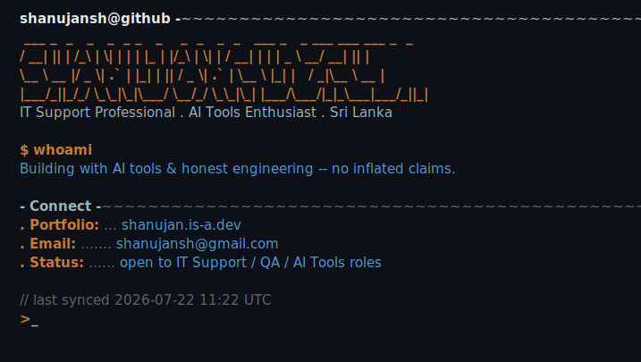
</p>
<p align="center">
  
</p>

---


<p align="center">
  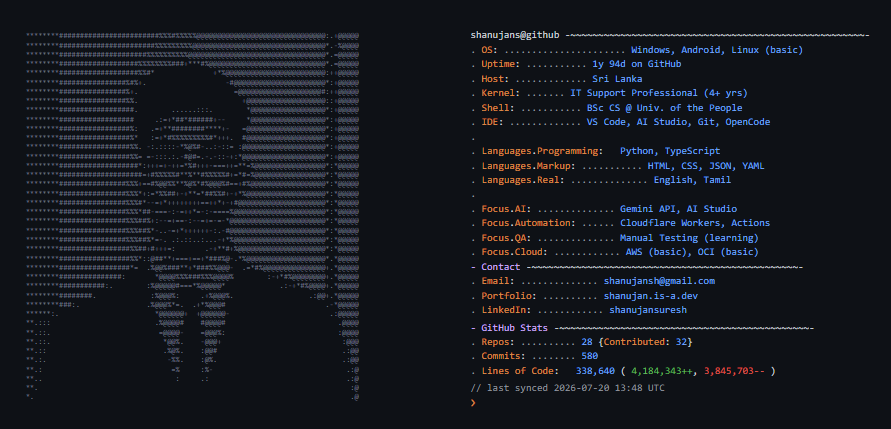
</p>
<p align="center">
  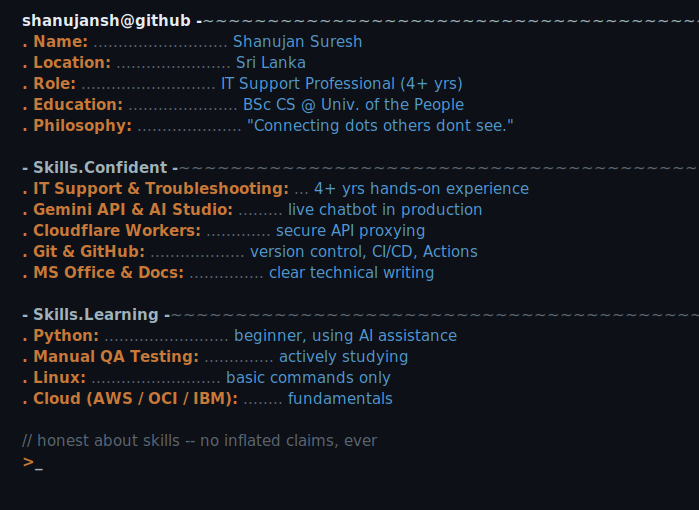
</p>

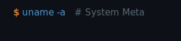

<p align="center">
  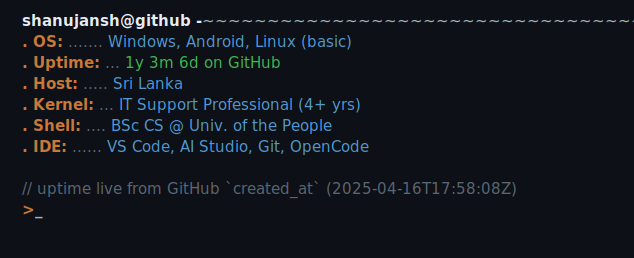
</p>


<p align="center">
  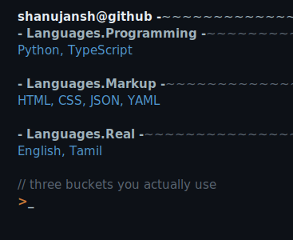
</p>

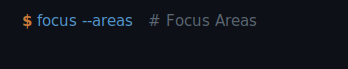

<p align="center">
  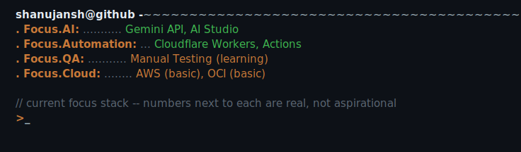
</p>


<p align="center">
  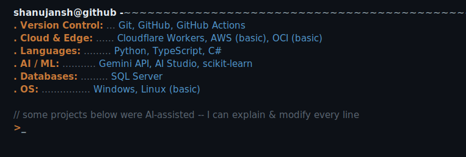
</p>

---

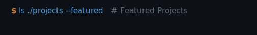

<p align="center">
  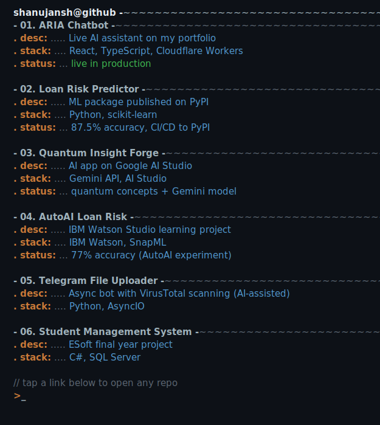
</p>

---

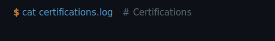

<p align="center">
  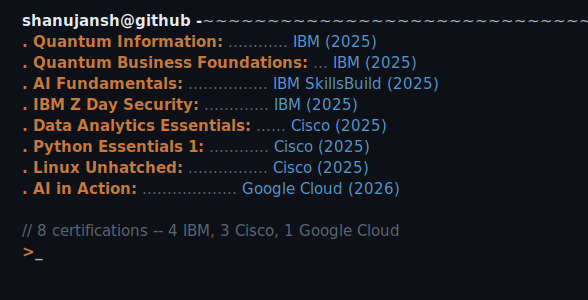
</p>

<sub>Replace the placeholder `verify_url` values for each cert in `scripts/terminal_data.json` with the real Issuer verification URLs (Credly / IBM SkillsBuild / Cisco NetAcad etc.) to make the rows link to your actual credential pages.</sub>

---

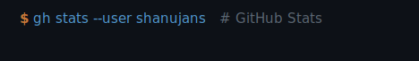

<p align="center">
  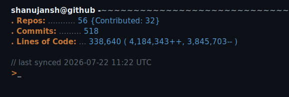
</p>

<sub>This card is regenerated by `.github/workflows/refresh-terminal.yml` using live GitHub API data + the `last_known_loc` baseline in `scripts/terminal_data.json`. Each regeneration stamps `// last synced YYYY-MM-DD HH:MM UTC` at the bottom of the card.</sub>

<p align="center">
  <a href="https://github.com/shanujans"></a>
  <a href="https://github.com/shanujans"></a>
</p>
<p align="center">
  <a href="https://github.com/shanujans"></a>
</p>

<sub>⚠️ The three widgets above are rendered live by external services — their font is fixed there, only their colors are matched to the terminal palette.</sub>

---

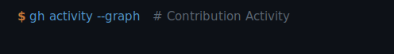

<p align="center">
  <a href="https://github.com/shanujans"></a>
</p>

---

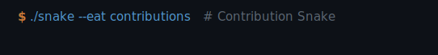

<p align="center">
  
</p>

<sub>To recolor the snake itself, add these query params to your `Platane/snk` workflow output line:</sub>

```yaml
outputs: |
  dist/github-contribution-grid-snake.svg?color_snake=%23ca7938&color_dots=%230d1117,%231b2b3a,%232f5a86,%235299d2,%23ca7938
```

---

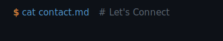

<p align="center">
  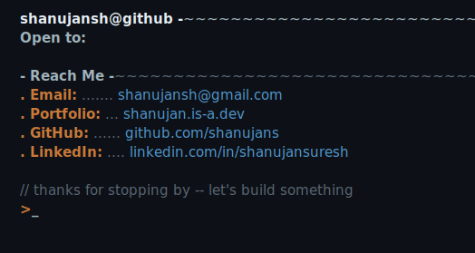
</p>

<p align="center">
  📬 <a href="mailto:shanujansh@gmail.com">Email</a> ·
  <a href="https://shanujan.is-a.dev">Portfolio</a> ·
  <a href="https://github.com/shanujans">GitHub</a> ·
  <a href="https://www.linkedin.com/in/shanujansuresh/">LinkedIn</a>
</p>
