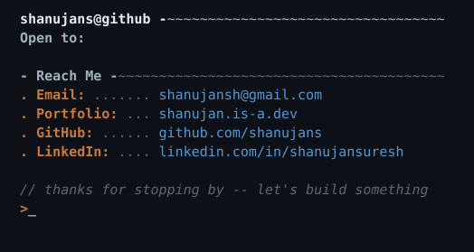

  <a href="https://github.com/shanujans">
    <picture>
      <source media="(prefers-color-scheme: dark)" srcset="https://raw.githubusercontent.com/shanujans/shanujans/main/dark_mode.svg">
      <source media="(prefers-color-scheme: light)" srcset="https://raw.githubusercontent.com/shanujans/shanujans/main/light_mode.svg">
      
    </picture>
  </a>

<a href="mailto:shanujansh@gmail.com">Email</a> &middot; <a href="https://shanujan.is-a.dev">Portfolio</a> &middot; <a href="https://github.com/shanujans">GitHub</a> &middot; <a href="https://www.linkedin.com/in/shanujansuresh/">LinkedIn</a>

