

  <a href="https://github.com/shanujans">
    <picture>
      <source media="(prefers-color-scheme: dark)" srcset="https://raw.githubusercontent.com/shanujans/shanujans/main/dark_mode.svg">
      <source media="(prefers-color-scheme: light)" srcset="https://raw.githubusercontent.com/shanujans/shanujans/main/light_mode.svg">
      
    </picture>
  </a>

  

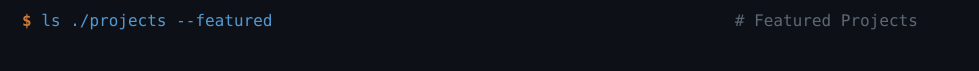
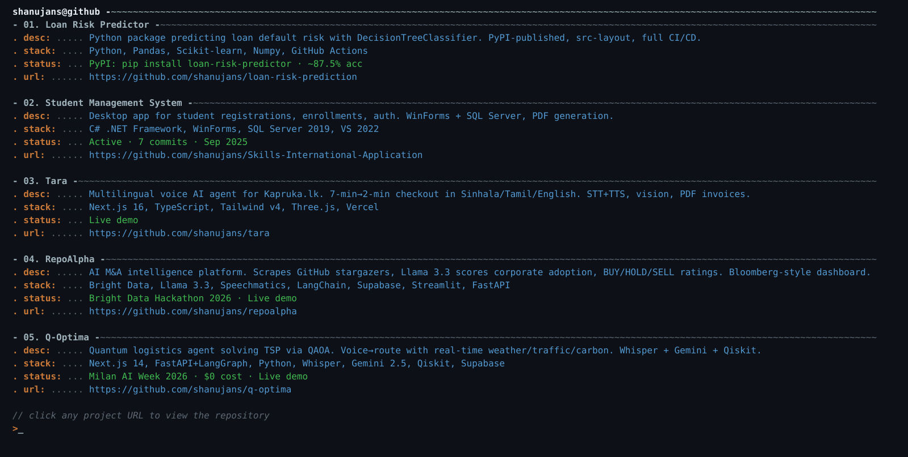

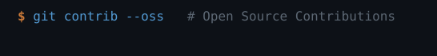
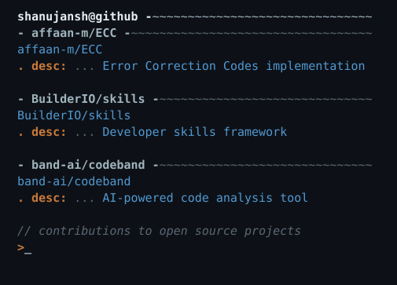

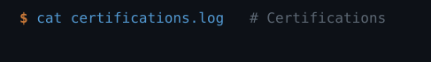
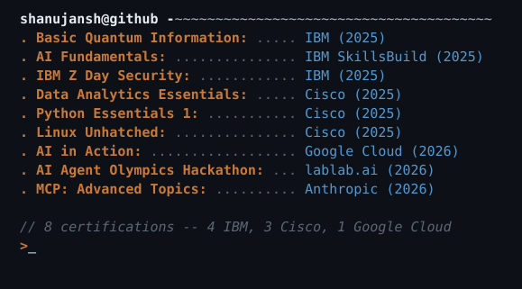

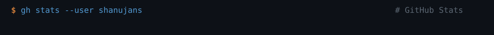
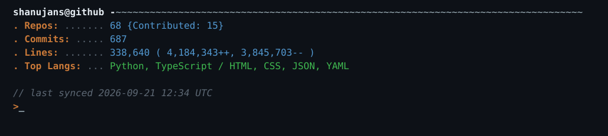

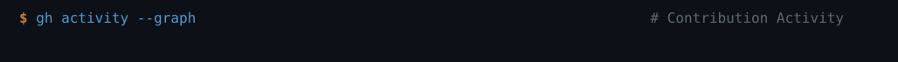

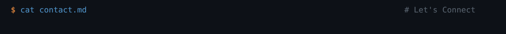
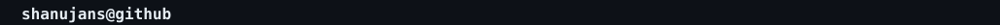

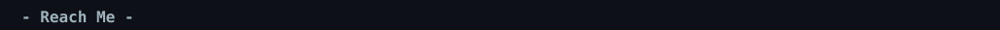
<a href="mailto:shanujansh@gmail.com" target="_blank" style="text-decoration:none;display:block">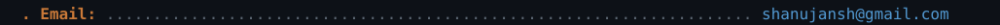</a>
<a href="https://shanujan.is-a.dev" target="_blank" style="text-decoration:none;display:block">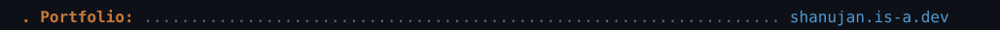</a>
<a href="https://github.com/shanujans" target="_blank" style="text-decoration:none;display:block">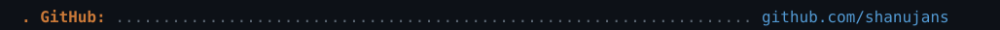</a>
<a href="https://www.linkedin.com/in/shanujansuresh/" target="_blank" style="text-decoration:none;display:block">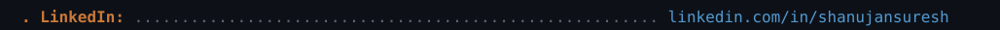</a>
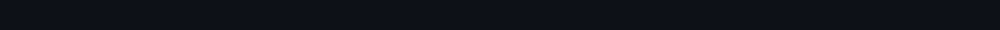
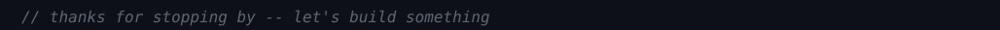
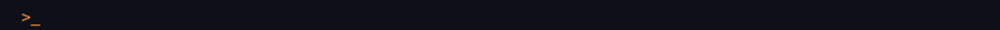

